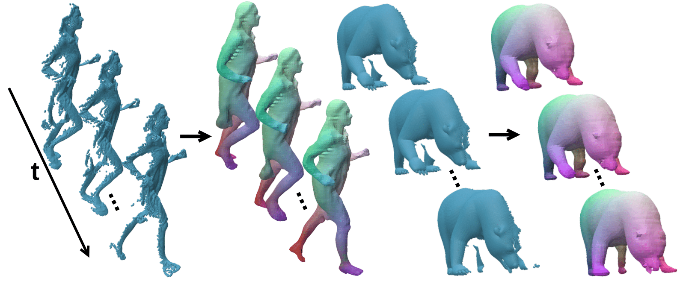
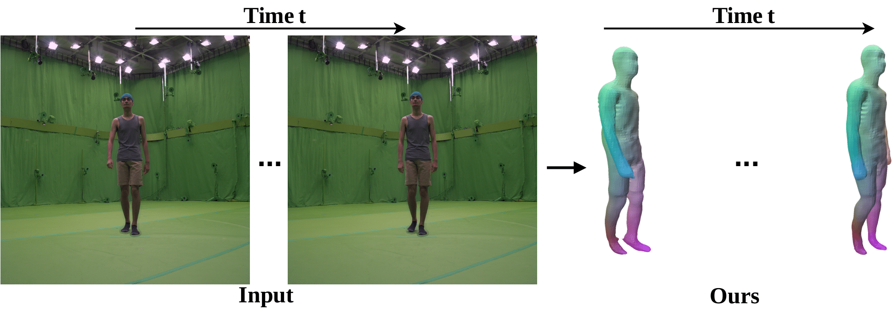
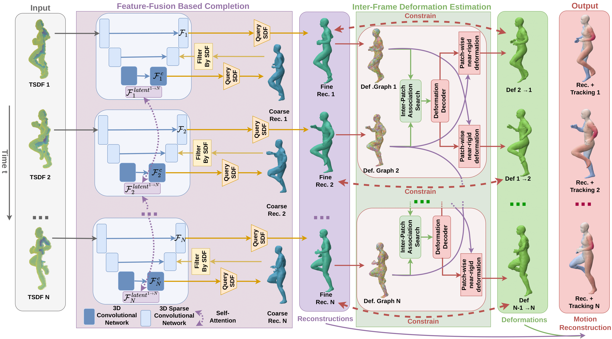

[**Aymen Merrouche**](https://aymenmer.github.io/), [Stefanie Wuhrer](https://swuhrer.gitlabpages.inria.fr/website/), [Edmond Boyer](https://morpheo.inrialpes.fr/people/Boyer/).

[Arxiv Preprint](https://arxiv.org/abs/2412.08511)

  
  

*Figure: Sample Results.*

  
*Figure: Overview of our approach. Given Truncated Signed Distance Field grids representing partial observations of a moving 3D shape (leftmost), the method achieves detailed reconstructions with dense tracking (rightmost). During Feature-Fusion Based Completion (purple module), the TSDFs are encoded in a latent space where self-attention allows to fuse and complete the observed information. The fused latent features are decoded into coarse shapes and then refined where this coarse surface locates. During Inter-Frame Deformation Estimation (green module), the fusion is further constrained by fitting the  reconstructions to a patch-wise near-rigid mesh deformation model that implements a near-isometric deformation assumption promoting their consistency.*
