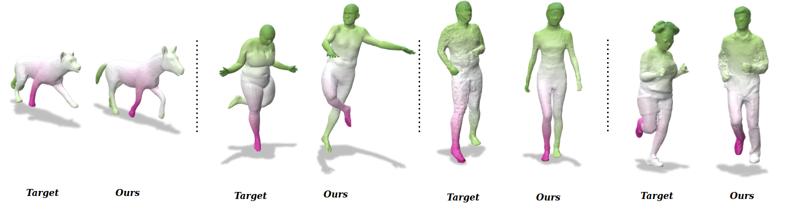
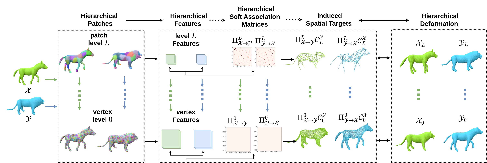

[**Aymen Merrouche**](https://aymenmer.github.io/), [Joao Regateiro](https://joaoregateiro.github.io/), [Stefanie Wuhrer](https://swuhrer.gitlabpages.inria.fr/website/), [Edmond Boyer](https://morpheo.inrialpes.fr/people/Boyer/).

[arXiv Preprint](https://arxiv.org/abs/2311.15668)  

[Published Version (with a short video, poster and supplementary)](https://proceedings.bmvc2023.org/417/)

[code](https://gitlab.inria.fr/amerrouc/deformation-guided-unsupervised-non-rigid-shape-matching/-/tree/main?ref_type=heads)

 
*Figure: Sample Results.*

  
*Figure: Method overview. The method takes as input a pair of 3D meshes $\mathcal{X}, \mathcal{Y}$, decomposed into a hierarchy of non-overlapping surface patches. It is divided into two steps that work from coarse to fine levels, sequentially per level. An association step extracts coarse-to-fine correspondences between $\mathcal{X}$ and $\mathcal{Y}$ as inter-patch association matrices (from $\Pi^L$ to $\Pi^0$), which induce spatial deformation targets. A deformation step outputs deformations that achieve these targets in 3D (from $\mathcal{X}_L$, $\mathcal{Y}_L$ to $\mathcal{X}_0$, $\mathcal{Y}_0$).*
