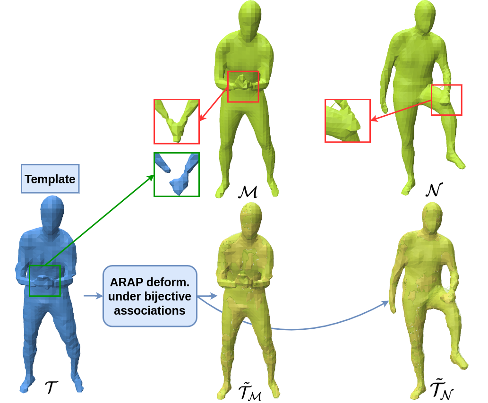

[**Aymen Merrouche**](https://aymenmer.github.io/), [Stefanie Wuhrer](https://swuhrer.gitlabpages.inria.fr/website/), [Edmond Boyer](https://morpheo.inrialpes.fr/people/Boyer/).

[Arxiv Preprint](https://arxiv.org/abs/2509.06862)

  
*Figure: To match two meshes $\mathcal{M}$ and $\mathcal{N}$ with topological artefacts (see red boxes), we jointly optimise for a template $\mathcal{T}$, initialised as either $\mathcal{M}$ or $\mathcal{N}$, and its alignments $\tilde{\mathcal{T}}_{\mathcal{M}}$ and $\tilde{\mathcal{T}}_{\mathcal{N}}$ with $\mathcal{M}$ and $\mathcal{N}$ using a novel topology adaptive deformation model (see green box) under ARAP and bijective associations constraints.*
